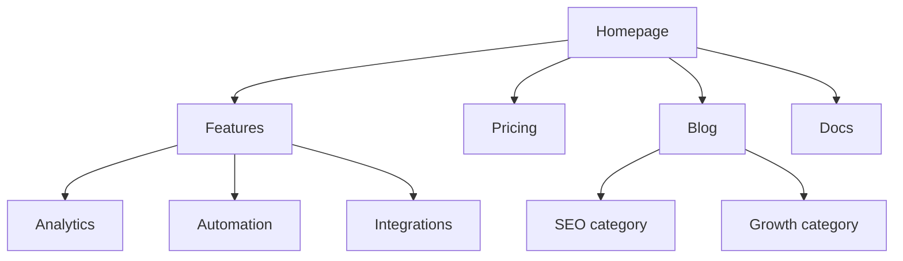
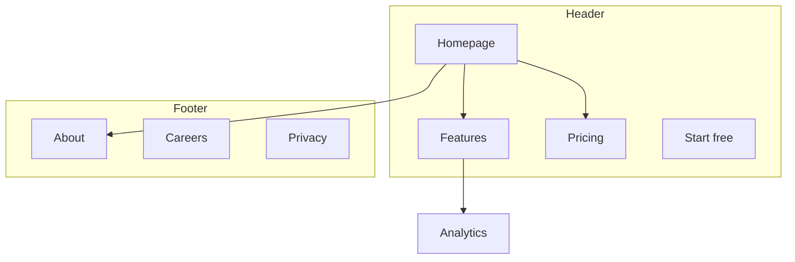
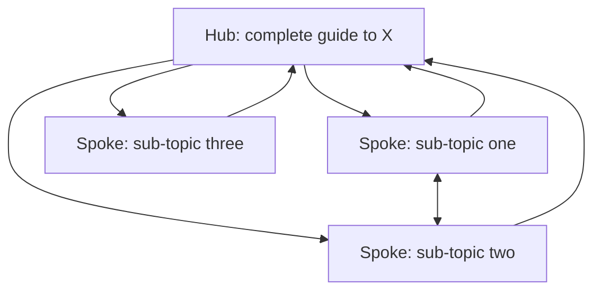

# Architecture patterns and output formats

## URL pattern per page type

| Page type | Pattern | Example |
| --- | --- | --- |
| Homepage | `/` | `example.com` |
| Feature | `/features/{name}` | `/features/analytics` |
| Pricing | `/pricing` | `/pricing` |
| Blog post | `/blog/{slug}` | `/blog/seo-guide` |
| Blog category | `/blog/category/{slug}` | `/blog/category/seo` |
| Case study | `/customers/{slug}` | `/customers/acme` |
| Documentation | `/docs/{section}/{page}` | `/docs/api/authentication` |
| Comparison | `/compare/{competitor}` | `/compare/competitor-name` |
| Integration | `/integrations/{name}` | `/integrations/slack` |
| Template | `/templates/{slug}` | `/templates/marketing-plan` |
| Landing page | `/{slug}` or `/lp/{slug}` | `/free-trial` |
| Legal | `/{page}` | `/privacy`, `/terms` |

Pick one parent per page class and keep it. Half the site under `/features/` and half under `/product/` is the most common inconsistency, and it splits the internal linking that should have accumulated on one section.

## Navigation layouts

Header, 4 to 7 items, ordered by importance:

```text
[Logo]   Product   Solutions   Pricing   Resources   Docs        [Sign in] [Start free]
```

Mega menu, at most 3 to 4 columns, each with a heading so the group is scannable:

```text
Product ▾
  Platform            Use cases           Resources
  Analytics           For marketing       Docs
  Automation          For sales           Changelog
  Integrations        For support         Status
```

Footer, grouped:

```text
Product          Resources        Company          Legal
Features         Blog             About            Privacy
Pricing          Case studies     Careers          Terms
Integrations     Templates        Contact          Security
Changelog        Docs             Press
```

Breadcrumbs mirror the URL, current page unlinked:

```text
Home > Features > Analytics
Home > Blog > SEO > Internal linking that actually works
Home > Docs > API > Authentication
```

| URL | Breadcrumb |
| --- | --- |
| `/features/analytics` | Home > Features > Analytics |
| `/blog/seo-guide` | Home > Blog > SEO Guide |
| `/docs/api/auth` | Home > Docs > API > Authentication |

## ASCII tree

The default for handing back a hierarchy. Put the URL beside every node so it doubles as the URL map.

```text
Homepage (/)
├── Features (/features)
│   ├── Analytics (/features/analytics)
│   ├── Automation (/features/automation)
│   └── Integrations (/features/integrations)
├── Pricing (/pricing)
├── Blog (/blog)
│   ├── SEO (/blog/category/seo)
│   └── Growth (/blog/category/growth)
├── Resources (/resources)
│   ├── Case studies (/customers)
│   └── Templates (/templates)
├── Docs (/docs)
│   ├── Getting started (/docs/getting-started)
│   └── API reference (/docs/api)
├── About (/about)
│   └── Careers (/about/careers)
└── Contact (/contact)
```

Use ASCII for a quick draft or anywhere the output is text. Use Mermaid when the point is the shape rather than the list, or when navigation zones and cross-links matter.

## Mermaid diagrams

Hierarchy:



Navigation zones, to show what's reachable from where:



Hub and spoke, to show a content cluster's linking:



## URL map table

The deliverable a developer or a CMS owner can work from directly.

| Page | URL | Parent | Navigation | Priority |
| --- | --- | --- | --- | --- |
| Homepage | `/` | none | Header | High |
| Features | `/features` | Homepage | Header | High |
| Analytics | `/features/analytics` | Features | Header dropdown | High |
| Pricing | `/pricing` | Homepage | Header | High |
| Blog | `/blog` | Homepage | Header | Medium |
| About | `/about` | Homepage | Footer | Low |

## Redirect list

Required output whenever a URL moves. Without it, the links pointing at the old URL stop counting.

| Old URL | New URL | Type |
| --- | --- | --- |
| `/product/analytics` | `/features/analytics` | 301 |
| `/blog/2026/07/post-title` | `/blog/post-title` | 301 |

Redirect to the final destination rather than through a chain, and check that no redirect target is itself redirected.

## Link audit checks

- Every page has at least one inbound internal link.
- No internal link returns a 404 or lands on a redirect.
- Anchor text describes the destination.
- The pages that matter most have the most inbound internal links.
- Breadcrumbs exist site-wide and carry `BreadcrumbList` schema.
- Posts have related-content links, and clusters link back to their hub.
- Cross-section links exist where a reader would want one: features to case studies, blog to product.
